  <picture>
    <source media="(max-width: 600px) and (prefers-color-scheme: dark)" srcset="https://raw.githubusercontent.com/130U/130U/profile-assets/assets/generated/hero-mobile-dark.svg">
    <source media="(max-width: 600px) and (prefers-color-scheme: light)" srcset="https://raw.githubusercontent.com/130U/130U/profile-assets/assets/generated/hero-mobile-light.svg">
    <source media="(prefers-color-scheme: dark)" srcset="https://raw.githubusercontent.com/130U/130U/profile-assets/assets/generated/hero-dark.svg">
    <source media="(prefers-color-scheme: light)" srcset="https://raw.githubusercontent.com/130U/130U/profile-assets/assets/generated/hero-light.svg">
    
  </picture>

 

  <picture>
    <source media="(max-width: 600px) and (prefers-color-scheme: dark)" srcset="https://raw.githubusercontent.com/130U/130U/profile-assets/assets/generated/telemetry-mobile-dark.svg">
    <source media="(max-width: 600px) and (prefers-color-scheme: light)" srcset="https://raw.githubusercontent.com/130U/130U/profile-assets/assets/generated/telemetry-mobile-light.svg">
    <source media="(prefers-color-scheme: dark)" srcset="https://raw.githubusercontent.com/130U/130U/profile-assets/assets/generated/telemetry-dark.svg">
    <source media="(prefers-color-scheme: light)" srcset="https://raw.githubusercontent.com/130U/130U/profile-assets/assets/generated/telemetry-light.svg">
    
  </picture>

 

  <picture>
    <source media="(max-width: 600px) and (prefers-color-scheme: dark)" srcset="https://raw.githubusercontent.com/130U/130U/profile-assets/assets/generated/signals-mobile-dark.svg">
    <source media="(max-width: 600px) and (prefers-color-scheme: light)" srcset="https://raw.githubusercontent.com/130U/130U/profile-assets/assets/generated/signals-mobile-light.svg">
    <source media="(prefers-color-scheme: dark)" srcset="https://raw.githubusercontent.com/130U/130U/profile-assets/assets/generated/signals-dark.svg">
    <source media="(prefers-color-scheme: light)" srcset="https://raw.githubusercontent.com/130U/130U/profile-assets/assets/generated/signals-light.svg">
    
  </picture>

## Evidence before spectacle

I study how intelligent systems are built, measured, and made trustworthy. My work connects agentic AI, benchmark production, evaluator integrity, embodied intelligence, and research infrastructure.

The through-line is simple: turn ambiguous technical questions into evidence that can be inspected, challenged, and used.

## Selected systems

| System | What it demonstrates |
| --- | --- |
| [Agents' Last Exam](https://github.com/130U/agents-last-exam) | An evidence-led architecture for producing, evaluating, and governing private agent benchmarks. |
| [Research Portfolio](https://github.com/130U/reserach-portfolio-since2026) | Deep research on vision-language-action models, world models, and emerging embodied-AI systems. |
| [BaZi Context Agent](https://github.com/130U/bazi-context-agent) | A local-first prototype that separates deterministic reasoning, user-controlled context, and AI-assisted interpretation. |
| [Info Collector](https://github.com/130U/info-collector-2026) | A research workflow that turns public reading into structured, traceable, reusable knowledge. |

## Current questions

- How do we evaluate configured agent systems rather than isolated models?
- What makes an automated evaluator valid, auditable, and resistant to gaming?
- How can research operations preserve evidence without slowing down iteration?
- Where do world models, VLA systems, and agentic workflows meaningfully converge?

  On GitHub since 20 July 2026 at 23:13 Beijing time. Project commits and pull requests use GitHub's author-search surface across the four repositories listed above. Code proportions use GitHub Linguist bytes across the same scope. The research orbit maps visible work; it is not a performance score.

