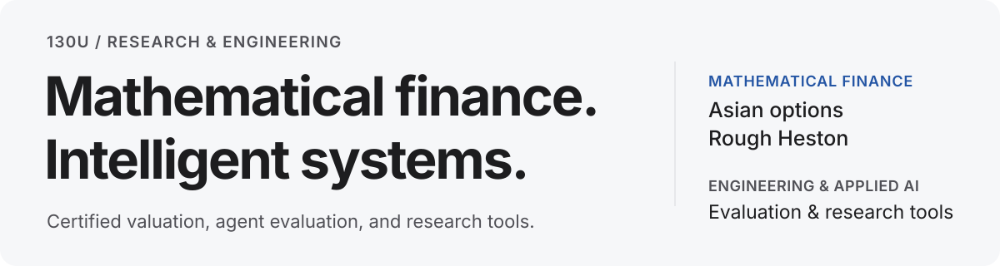
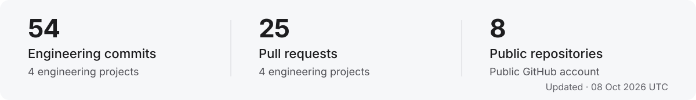

  <picture>
    <source media="(max-width: 767px) and (prefers-color-scheme: dark)" srcset="https://raw.githubusercontent.com/130U/130U/main/assets/generated/hero-mobile-dark-v2.svg">
    <source media="(max-width: 767px) and (prefers-color-scheme: light)" srcset="https://raw.githubusercontent.com/130U/130U/main/assets/generated/hero-mobile-light-v2.svg">
    <source media="(prefers-color-scheme: dark)" srcset="https://raw.githubusercontent.com/130U/130U/main/assets/generated/hero-dark-v2.svg">
    <source media="(prefers-color-scheme: light)" srcset="https://raw.githubusercontent.com/130U/130U/main/assets/generated/hero-light-v2.svg">
    
  </picture>

  <a href="#mathematical-finance">Mathematical Finance</a>
  &nbsp;&middot;&nbsp;
  <a href="#engineering--applied-ai">Engineering &amp; Applied AI</a>

My work combines mathematical finance research with engineering for intelligent systems. I develop rigorous methods for option valuation, evaluation tools for AI agents, and software for research workflows.

## Mathematical Finance

### Certified Valuation of Arithmetic Asian Options

Computable pricing-error bounds for arithmetic Asian call spreads under Heston, combining Gaussian smoothing, validated transform arithmetic, and complete error certificates for a projected Euler scheme at specified parameter points.

[Paper](https://github.com/130U/certified-valuation-arithmetic-asian-options/blob/main/manuscript/report.md) &nbsp;&middot;&nbsp; [Repository](https://github.com/130U/certified-valuation-arithmetic-asian-options) &nbsp;&middot;&nbsp; [Certificates & evidence](https://github.com/130U/certified-valuation-arithmetic-asian-options/blob/main/EVIDENCE.md)

### Certified Joint Pricing Errors in Rough Heston

Deterministic error certificates for rough Heston pricing, propagating fractional Riccati residuals through the pricing calculation and retaining shared Fourier errors to bound portfolio errors and compare finite parameter candidates.

[Paper](https://github.com/130U/certified-rough-heston-valuation/blob/main/ARTICLE.md) &nbsp;&middot;&nbsp; [Repository](https://github.com/130U/certified-rough-heston-valuation) &nbsp;&middot;&nbsp; [Certificates & evidence](https://github.com/130U/certified-rough-heston-valuation/blob/main/EVIDENCE.md)

## Engineering & Applied AI

| Project | Focus |
| --- | --- |
| [Agent Evaluation Methodology](https://github.com/130U/agent-evaluation-methodology) | Evaluation tooling and controlled experiments for τ2-bench, covering evaluator integrity, behavior attribution, and the admission of feedback into agent-policy updates. |
| [AI & Robotics Research Portfolio](https://github.com/130U/reserach-portfolio-since2026) | Source-linked technical analyses of vision-language-action models, world models, and robotic control, including comparisons of emerging architectures and competitive landscapes. |
| [BaZi Context Agent](https://github.com/130U/bazi-context-agent) | A TypeScript prototype for deterministic BaZi rectification, user-controlled context, and structured reporting, with privacy controls and an offline evaluation harness. |
| [Info Collector](https://github.com/130U/info-collector-2026) | A local-first reading workspace with Chrome capture, Chinese translation and summarization, searchable articles, Markdown archives, and weekly review exports. |

## GitHub Activity

  <picture>
    <source media="(max-width: 767px) and (prefers-color-scheme: dark)" srcset="https://raw.githubusercontent.com/130U/130U/main/assets/generated/telemetry-mobile-dark-v2.svg">
    <source media="(max-width: 767px) and (prefers-color-scheme: light)" srcset="https://raw.githubusercontent.com/130U/130U/main/assets/generated/telemetry-mobile-light-v2.svg">
    <source media="(prefers-color-scheme: dark)" srcset="https://raw.githubusercontent.com/130U/130U/main/assets/generated/telemetry-dark-v2.svg">
    <source media="(prefers-color-scheme: light)" srcset="https://raw.githubusercontent.com/130U/130U/main/assets/generated/telemetry-light-v2.svg">
    
  </picture>

  <a href="https://github.com/search?q=author%3A130U&amp;type=commits">Commits</a>
  &nbsp;&middot;&nbsp;
  <a href="https://github.com/pulls?q=is%3Apr+author%3A130U">Pull requests</a>
  &nbsp;&middot;&nbsp;
  <a href="https://github.com/130U?tab=repositories">Repositories</a>

Commit and pull-request counts cover the four engineering projects above. Updated daily from GitHub. [Update history](https://github.com/130U/130U/actions/workflows/update-profile.yml) · [Data sources](docs/profile-data.md)
