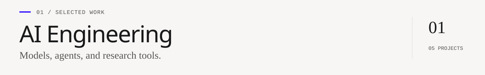
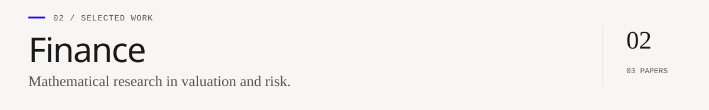

<picture>
  <source media="(max-width: 767px) and (prefers-color-scheme: dark)" srcset="https://raw.githubusercontent.com/130U/130U/main/assets/generated/hero-mobile-dark-v5.svg">
  <source media="(max-width: 767px) and (prefers-color-scheme: light)" srcset="https://raw.githubusercontent.com/130U/130U/main/assets/generated/hero-mobile-light-v5.svg">
  <source media="(prefers-color-scheme: dark)" srcset="https://raw.githubusercontent.com/130U/130U/main/assets/generated/hero-dark-v5.svg">
  <source media="(prefers-color-scheme: light)" srcset="https://raw.githubusercontent.com/130U/130U/main/assets/generated/hero-light-v5.svg">
  
</picture>

I build AI systems and develop mathematical methods for financial decisions.

 

<table width="100%"><tr><td>

<picture>
  <source media="(prefers-color-scheme: dark) and (max-width: 767px)" srcset="https://raw.githubusercontent.com/130U/130U/main/assets/layout/sheet-ai-mobile-dark-v2.svg">
  <source media="(max-width: 767px)" srcset="https://raw.githubusercontent.com/130U/130U/main/assets/layout/sheet-ai-mobile-light-v2.svg">
  <source media="(prefers-color-scheme: dark)" srcset="https://raw.githubusercontent.com/130U/130U/main/assets/layout/sheet-ai-dark-v2.svg">
  
</picture>

<h3>01 &nbsp; Agent Evaluation Methodology</h3>

I develop <strong>ICFA</strong>, a method for deciding which evaluation feedback belongs in an agent’s prompt update. It connects the diagnosis to what the agent knew, who produced the behavior, and what the optimizer can change.

<h3>02 &nbsp; 130U-FinLLM</h3>

<strong>24.26M parameters · 42.47M additional training tokens prepared</strong>

I built a native PyTorch system for asset-specific financial language modeling from random initialization, with a self-trained tokenizer, complete checkpoint recovery, and separate data partitions for selection, calibration, and testing. <em>Financial stance accuracy remains unevaluated.</em>

Method &amp; evidence

 

I built <strong>130U-FinLLM</strong>, a native PyTorch training and evaluation system for financial language modeling from random initialization. Its <strong>24.26M-parameter decoder</strong> and self-trained 8K tokenizer address a precise problem: identifying bearish, neutral, or bullish stance toward a specified asset. I implemented corpus preparation, pretraining, supervised fine-tuning, and preference-training experiments, with separate data partitions for model selection, probability calibration, review thresholds, and final testing.

The pipeline prepared <strong>42.47 million additional training tokens</strong>, with seed and candidate evaluation documents excluded. Training recovery restores the optimizer, scheduler, random state, and corpus position; calibration artifacts remain tied to their checkpoint and tokenizer. This brings data engineering, model training, and evaluation into a working research system. The public records document pretraining progress; financial stance accuracy has not yet been evaluated.

<h3>03 &nbsp; Research Portfolio</h3>

Technical analysis of robotics and world models: how language becomes continuous robot action, what architectures learn, and what delivery models mean for adoption.

<h3>04 &nbsp; BaZi Context Agent</h3>

An interactive interpretation system that compares uncertain birth-hour candidates, fixes a working selection, and introduces personal context through a separate reporting layer.

<h3>05 &nbsp; Info Collector</h3>

A reading application that turns saved webpages into translations, summaries, and a searchable local library, with a weekly review of what was read.

</td></tr></table>

 
 

<table width="100%"><tr><td>

<picture>
  <source media="(prefers-color-scheme: dark) and (max-width: 767px)" srcset="https://raw.githubusercontent.com/130U/130U/main/assets/layout/sheet-finance-mobile-dark-v2.svg">
  <source media="(max-width: 767px)" srcset="https://raw.githubusercontent.com/130U/130U/main/assets/layout/sheet-finance-mobile-light-v2.svg">
  <source media="(prefers-color-scheme: dark)" srcset="https://raw.githubusercontent.com/130U/130U/main/assets/layout/sheet-finance-dark-v2.svg">
  
</picture>

<h3>01 &nbsp; Arithmetic Asian Options</h3>

I connect payoff analysis, stochastic dynamics, and validated computation to certify discretization error. A shared Gaussian factor yields a weighted payoff-remainder bound. The paper’s one-year Heston Asian call spread with twelve monthly fixings has a complete discretization-error bound below <strong>0.011025 price units</strong>.

Method &amp; evidence

 

I develop a mathematical framework for certifying discretization error in arithmetic Asian valuation. Its core is a weighted payoff-remainder bound derived from a Gaussian factor shared across observation dates. This connects the payoff’s nonsmooth structure to computable moment bounds, which I combine with validated transforms for the original projected Euler scheme under Heston stochastic volatility.

In the paper’s one-year Heston Asian call-spread example with twelve monthly fixings, the framework establishes a complete discretization-error bound below <strong>0.011025 price units</strong>. The contribution connects payoff analysis, stochastic dynamics and validated computation to give a rigorous monetary guarantee for the discrete valuation.

<h3>02 &nbsp; Joint Pricing Errors in Rough Heston</h3>

I establish joint pricing-error bounds that retain Fourier perturbations shared across strikes, using a finite-history theorem for fractional Riccati residuals. For the paper’s quarter-year 4400–4500 call spread, the stored output has a complete error upper bound of <strong>0.233318843 index points</strong>, meeting a <strong>0.25-point budget</strong>.

Method &amp; evidence

 

I establish a deterministic framework for joint pricing-error certification in rough Heston. A finite-history theorem carries continuous fractional Riccati residuals into the pricing exponent, while a joint error set preserves the Fourier perturbations shared across strikes. Together, these results provide rigorous bounds for spreads and portfolio valuations sharing the same model and maturity.

For the paper’s quarter-year <strong>4400–4500 call spread</strong>, the framework certifies the stored numerical output with a complete error upper bound of <strong>0.233318843 index points</strong>, meeting a <strong>0.25-point accuracy budget</strong>. The certificate includes quadrature, omitted frequencies, the infinite tail and arithmetic, connecting fractional dynamics to a checkable guarantee for the valuation.

<h3>03 &nbsp; Critical Dependence Stress</h3>

For small reallocations in an exchangeable box model, I derive a <strong>common quadratic law</strong> for the dependence-stress budgets that erase or reverse diversification gains under fixed marginals. In the independent uniform benchmark with median Expected Shortfall, equal exposures, and transport weights (1, 1, 2), the critical coefficient is <strong>at least 30% above</strong> the tangent prediction.

Method &amp; evidence

 

I develop a reverse stress-testing theory for a precise portfolio decision: how much can dependence change before a diversification gain disappears, with every marginal loss distribution held fixed? For small reallocations in an exchangeable box model, I derive a <strong>common quadratic law</strong> for the stress budgets that produce a tie or a strict reversal. The analysis connects a variational limit with exact marginal restoration and identifies the extra cost that local sensitivity alone misses.

In the independent uniform benchmark with median Expected Shortfall, equal exposures, and transport weights (1, 1, 2), I bound the critical coefficient between <strong>0.203125 and 0.302083...</strong>, <strong>at least 30% above</strong> the tangent prediction of 0.15625. The paper also characterizes when the restoration premium vanishes and uses continuous maximum-flow/minimum-cut duality to explain how the background portfolio absorbs stress.

</td></tr></table>

 

<!-- PROFILE_ACTIVITY -->

---

<picture>
  <source media="(max-width: 767px) and (prefers-color-scheme: dark)" srcset="https://raw.githubusercontent.com/130U/130U/main/assets/generated/telemetry-mobile-dark-v5.svg">
  <source media="(max-width: 767px) and (prefers-color-scheme: light)" srcset="https://raw.githubusercontent.com/130U/130U/main/assets/generated/telemetry-mobile-light-v5.svg">
  <source media="(prefers-color-scheme: dark)" srcset="https://raw.githubusercontent.com/130U/130U/main/assets/generated/telemetry-dark-v5.svg">
  <source media="(prefers-color-scheme: light)" srcset="https://raw.githubusercontent.com/130U/130U/main/assets/generated/telemetry-light-v5.svg">
  
</picture>

[Activity updates](https://github.com/130U/130U/actions/workflows/update-profile.yml) · [Data sources](docs/profile-data.md)
